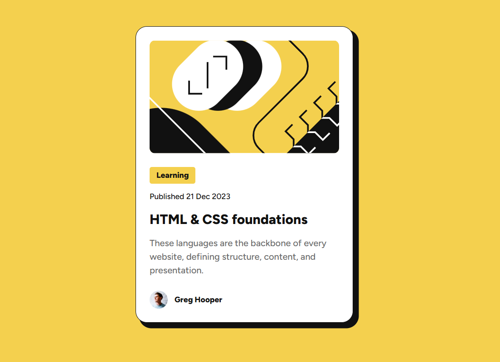

# Frontend Mentor - Blog preview card solution

This is a solution to the [Blog preview card challenge on Frontend Mentor](https://www.frontendmentor.io/challenges/blog-preview-card-ckPaj01IcS). Frontend Mentor challenges help you improve your coding skills by building realistic projects. 

## Table of contents

- [Overview](#overview)
  - [The challenge](#the-challenge)
- [My process](#my-process)
  - [Built with](#built-with)
  - [What I learned](#what-i-learned)
  - [Continued development](#continued-development)

**Note: Delete this note and update the table of contents based on what sections you keep.**

## Overview

### The challenge

Users should be able to:

- See hover and focus states for all interactive elements on the page

## My process

### Built with

- Semantic HTML5 markup
- CSS custom properties
- Flexbox
- Mobile-first workflow

### What I learned

#### HTML Semantics

- `<section>` implies a thematic block with its own heading — for generic layout divisions inside a component, `
` is correct.
- `alt` text should be descriptive and specific. Generic values like `"Preview image"` are meaningless to screen readers. Author avatars should identify the person: `"Greg Hooper, author avatar"`.
- Heading hierarchy matters. A page should have one `h1`, and headings should not skip levels. In a standalone demo, the card title is a good candidate for `h1`.
- Browsers apply their own UA styles to headings (`font-size: 2em`, `font-weight: bold`). These need to be neutralized in the reset so component classes have full, predictable control.

#### BEM Naming

BEM syntax is `block__element--modifier`.

- Every element class must be prefixed with its block: `publish__date` and `author__name` are orphaned — correct forms are `card__date` and `card__author-name`.
- Modifiers describe variants of an element (e.g. `card__category--featured`), not separate typography classes. Style and structure for the same element belong in one class, not two.
- Avoid targeting raw HTML tags inside a block (e.g. `.card__author img`). Give the element its own BEM class instead: `.card__avatar`.

#### CSS Reset

A reset's job is to get the browser out of the way so component styles have full, predictable control.

- The `*` selector should include `::before` and `::after` to also reset pseudo-elements: `*, *::before, *::after`.
- Images are inline by default, which creates a small baseline gap at the bottom of their container. The proper fix is in the reset: `img, picture, video, canvas, svg { display: block; max-width: 100%; }`. This avoids needing `line-height: 0` workarounds on image wrappers.
- Browsers do not inherit font on form elements by default. Adding `input, button, textarea, select { font: inherit; }` to the reset makes it portable across projects.

#### Typography & `rem` Units

- `font-size` on `body` does **not** set the `rem` base. `rem` is always relative to `<html>`, not `body`.
- Setting `html { font-size: 62.5%; }` makes `1rem = 10px`, which makes mental math trivial (`2.4rem = 24px`).
- Using `px` for font sizes overrides user browser preferences. Users with low vision may set their browser font larger — `rem`-based typography respects and scales with that preference. Hardcoded `px` stays frozen.
- `font-weight` and `line-height` that don't change between breakpoints should not be repeated inside media queries — only override what actually changes.

#### Responsiveness

- Fixed-width elements with breakpoints are fragile. `min()` handles all screen sizes in one declaration: `width: min(384px, calc(100% - 48px))` caps at `384px` on large screens and shrinks gracefully on small ones, making the media query unnecessary.
- Mobile-first means the default styles target the smallest screen, and `min-width` media queries progressively enhance for larger screens — the opposite of overriding desktop styles with `max-width`.
- `100vh` includes the browser chrome on some mobile browsers, causing layout jumps. The modern fix is `100dvh` (dynamic viewport height), with `100vh` as a fallback for older browsers.

#### Spacing Scale

- A spacing scale based on a `4px` base unit (as used by Tailwind) is predictable and covers all common cases.
- Token names like `--spacing-50`, `--spacing-100` don't communicate the actual value intuitively. Names like `--space-1` through `--space-8` (where the number maps to multiples of 4px) are clearer and align with industry conventions.
- Values that don't fit the scale (like a stray `20px`) signal a gap in the scale, not an exception — fill the gap rather than hardcode the value.
- Defining spacing tokens but not using them (`gap: 24px` instead of `gap: var(--space-6)`) defeats the purpose of the design system. Changing a token value should propagate everywhere automatically.

#### Accessibility Checklist Additions

- Visible focus styles are required for keyboard navigation. Any interactive element (links, buttons) needs a `:focus-visible` style.
- Avatar images pre-cropped as circles in the asset file appear round without CSS — but this is fragile. `border-radius: 50%` in CSS makes the shape explicit, self-documenting, and resilient to asset changes.

### Continued development

Images optimization and responsive images. 
